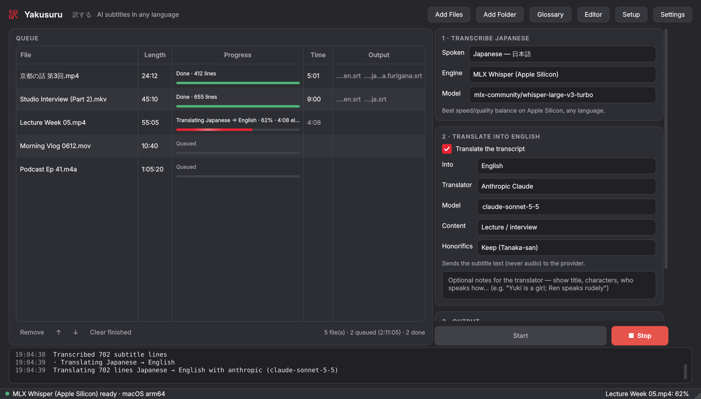

<p align="center"></p>

<h1 align="center">Yakusuru 訳する</h1>

<p align="center"><b>Turn any video into readable subtitles, in any language, right on your own computer.</b></p>

<p align="center">
  <a href="https://github.com/SwamiGattasG/yakusuru/releases/latest"></a>
  <a href="https://github.com/SwamiGattasG/yakusuru/actions/workflows/ci.yml"></a>
  
  <a href="LICENSE"></a>
</p>

<p align="center"></p>

## Why Yakusuru

You found the interview, the lecture, the indie film or the late-night variety show you wanted to watch, and it only exists in Japanese. Nobody has subtitled it, and probably nobody ever will.

The options for doing it yourself are not great. Auto captions from video sites are rough and stay in the original language. Online transcription services want your files uploaded to their servers and charge by the minute. The open source tools that actually do this well, like OpenAI's Whisper, expect you to live in a terminal and juggle Python versions, GPU drivers and gigabytes of model files before you see a single line of text.

Yakusuru (訳する, Japanese for *to translate*) puts that whole toolchain behind one friendly window. Drop in your files, press Start, and come back to subtitle files sitting right next to your videos, ready for any player.

## How it works

1. **It listens.** Speech is transcribed on your own machine with Whisper models, using whatever your hardware is best at: the GPU on Apple Silicon Macs, NVIDIA cards with CUDA, AMD and Intel graphics through Vulkan or ROCm, or simply the CPU.
2. **It translates.** The transcript is translated in context, a few dozen lines at a time, so names, tone and pronouns stay consistent from scene to scene. Use a free model that runs locally through Ollama, a cloud model you already have a key for (Claude, Grok, OpenAI, Gemini or DeepL), or Whisper's own built-in English translation. If you only want a transcript, switch translation off.
3. **It shapes the result.** Lines are split and timed for reading rather than dumped as a transcript, with short cues, comfortable line lengths and the usual AI hallucinations cleaned up. A built-in editor lets you fix anything it got wrong.

Your audio never leaves your computer. When you choose a cloud translator, only the subtitle text is sent.

Japanese to English gets extra care, with honorifics, Japanese-tuned models like kotoba-whisper and anime-whisper, and furigana. Every other pairing works too: the source can be any of Whisper's roughly 100 languages, and the target can be any language at all.

## Highlights

- **Made for people, not terminals.** A guided setup checks your machine, installs exactly what it needs and explains each step. On a Mac you open `Yakusuru.app`, on Windows `Yakusuru.exe`.
- **A queue you can walk away from.** Drop in files or whole folders and watch per-file progress, elapsed time and a breakdown of where the time went. If something stalls, Yakusuru tells you what it is waiting on, and Stop is always one click away.
- **Subtitles your player already understands.** Files are named by language (`show.en.srt`, `show.ja.srt` and a bilingual `show.ja-en.srt`), so VLC, mpv, IINA, Plex and Infuse pick them up automatically.
- **Furigana for Japanese learners.** Kana readings over the kanji, either as true ruby text in a `.vtt` file or inline in an `.srt`.
- **Consistent names and terms.** A glossary and short show notes keep character names, honorifics and jargon the same in every episode.
- **A real subtitle editor.** Preview the video, retime lines, split and merge, find and replace, and re-translate single lines.
- **Honest about failures.** If a translation comes back in the wrong language, the file is marked as failed instead of quietly saved, and the transcript is kept so you can retry just the translation.
- **Feels at home on your desktop.** Follows your system's light or dark mode and accent color, live.

## Download

Grab the latest zip from **[Releases](https://github.com/SwamiGattasG/yakusuru/releases/latest)**, unzip it anywhere, and follow the Quick start for your system below. The app downloads everything else it needs (Python packages and AI models) on first use.

- **macOS:** apps from the internet that aren't notarized by Apple are blocked the first time. Right-click **Yakusuru.app**, choose **Open**, then **Open** again. You only need to do this once.
- **Windows:** the first launch may show *"Windows protected your PC"*. Click **More info**, then **Run anyway**.

## Quick start

**macOS:** open `macOS/` and double-click **Yakusuru.app**. You can drag it to the Dock.
- The first run opens Terminal to set everything up, then opens the app.
- If macOS blocks it, right-click the file, choose **Open**, then confirm with **Open**.
- If setup is ever broken, run **Install or Repair.command**.

**Windows:** double-click `Windows/Yakusuru.exe`. The first run opens a console window that finds Python (or offers to install it with winget) and sets the app up; after that the exe opens the app directly. The exe isn't code-signed, so the first time Windows may show *"Windows protected your PC"*: click **More info → Run anyway**. `Yakusuru.bat` does the same in a console window, for troubleshooting.
- If Python is missing, it offers to install it with `winget`.
- Run **Create Desktop Shortcut.bat** once to get a shortcut with the app's icon.

**Linux:** run `bash Linux/install-desktop-entry.sh` once. It prepares the app and adds it to your applications menu. After that, start it from the menu or with `Linux/yakusuru.sh`.

### Python and CPU architecture

The launchers, `bootstrap.py` and the Setup Wizard all follow the same rules, kept in `app/yakusuru/platform_matrix.py`:
- **Native builds only.** An Intel (x86_64) Python on an ARM machine, whether through Rosetta on a Mac or emulation on Windows, is rejected with an explanation.
- **Newest supported version first.** Each launcher picks the newest native Python allowed for that platform.
- **Automatic rebuild.** If the existing environment was built for a different Python version or CPU architecture, it's rebuilt.

| Machine | Python | PyTorch | faster-whisper | MLX |
|---|---|---|---|---|
| Mac, Apple Silicon (M1 to M4) | 3.10 to 3.14 | ✓ Metal | ✓ (CPU) | ✓ (macOS 14+) |
| Mac, Intel | 3.10 to 3.12 | ✓ CPU | ✓ | ✗ |
| Windows x64 | 3.10 to 3.14 | ✓ CUDA / CPU | ✓ | ✗ |
| Windows on ARM | 3.10 to 3.13 | ✗ | ✗ | ✗ (uses whisper.cpp instead) |
| Linux x86_64 | 3.10 to 3.14 | ✓ CUDA / ROCm / CPU | ✓ | ✗ |
| Linux ARM64 | 3.10 to 3.14 | ✓ | ✓ | ✗ |

The wizard only offers acceleration profiles that exist for your OS and CPU, and it installs the matching build of each package, for example PyTorch with Metal on Apple Silicon or CUDA on NVIDIA. Native packages are installed from prebuilt binaries only, so a missing build fails quickly with a clear message instead of trying to compile from source.

On first launch the **Setup Wizard** walks you through four steps:
1. It detects your hardware and picks an acceleration profile.
2. It installs the matching engines.
3. It downloads models.
4. It stores optional API keys in your system keychain.

You can reopen it any time from **Tools → Setup Wizard**.

| Profile | Transcription engine | Notes |
|---|---|---|
| Apple Silicon | MLX Whisper, plus Transformers on MPS | Fastest on M-series Macs |
| NVIDIA | faster-whisper (CUDA), plus Transformers | Installs PyTorch for CUDA 12.8 |
| AMD on Linux | Transformers on PyTorch ROCm | Needs ROCm drivers installed |
| AMD / Intel on Windows | whisper.cpp (Vulkan build) | Prebuilt download from GitHub, or locate your own `whisper-cli` |
| CPU only | faster-whisper int8 | Works anywhere, but slower |

## Languages

- **Spoken (source):** any Whisper language, or **Auto-detect**. Choosing the language is faster and more reliable than detection.
- **Into (target):** any language for the LLM translators (Ollama, Claude, OpenAI, Gemini), including regional variants such as Chinese (Traditional) and Portuguese (Brazil).
  - **DeepL** supports about 30 languages; the app warns you before starting if a pair isn't available.
  - **Whisper built-in** translation only produces English.
- **Same language in and out** (for example Spanish → Spanish) gives you a cleaned-up transcript with no translation.
- **Output names** use language codes, for example `show.en.srt`, `show.ja.srt` and `show.ja-en.srt`, so video players pick the right track.
- **Japanese-only models:** kotoba-whisper and anime-whisper only understand Japanese. For other languages use large-v3 or large-v3-turbo; the app warns you if the model doesn't match the language.
- **Line wrapping** follows the script: Japanese, Chinese and Thai wrap by character, everything else by word, and full-width scripts use a shorter line limit.

## Choosing models (with Japanese tips)

**Transcription**
- **kotoba-whisper v2.0** is distilled from large-v3 and trained on Japanese. It's about 6x faster, with excellent accuracy on clean speech. It's the default on CPU.
- **anime-whisper** is tuned on about 5,300 hours of anime dialogue. It handles emotive, fast or whispered lines well.
  - It runs on the Transformers engine.
  - It drops sentence-final 。.
  - Don't give it an initial prompt; the app disables prompts for it automatically.
- **large-v3** is the safest all-rounder, and the only good choice for *Whisper built-in* translation.
- **large-v3-turbo** is fast, but it was not trained for Whisper's translate task.

**Translation**
- **Ollama, local and free:** `qwen3:14b` is a good default (about 10 GB). For more natural English, try `gemma3:12b`, or `gemma3:27b` if you have the memory. The model list also shows whatever you have installed.
- **Cloud:** Claude, Grok (xAI), OpenAI, Gemini or DeepL. Cloud translators use no local memory, which makes them the smoothest choice on machines with 8 to 16 GB of memory. Only the subtitle *text* is sent, never audio. Each model list is fetched live from the provider, so new model IDs appear automatically.
- **Whisper built-in:** the fastest and fully offline, but the most literal.

LLM translation works in batches of numbered lines, with previous and following lines as context, your glossary, and notes about the show. If a model skips a line, the app retries it automatically. Any lines that still fail are marked `[?]` so you can find them in the editor.

## All features
- **Translation is optional:** untick *Translate the transcript* to only transcribe. Later, right-click a finished file → **Translate Now**; the saved transcript is reused, so nothing is transcribed twice.
- **Memory-aware local translation:** before a local model (Ollama) translates, the speech model is unloaded. On machines with 18 GB or less, Ollama uses a smaller context window and is unloaded after each file. The app warns you when a local model is too big for your RAM and suggests a lighter one.
- Drag-and-drop queue for files or whole folders, with per-file progress. You can stop at any time; processing runs in a separate process, so the UI never freezes.
- Outputs: the translation, the original transcript and a bilingual file, named by language (`name.en.srt`, `name.ja.srt`, `name.ja-en.srt`). A `name.yakusuru.json` project file is saved alongside so you can edit later.
- Cleanup of common Whisper hallucinations on silence (such as 「ご視聴ありがとうございました」 or "Subtítulos realizados por la comunidad de Amara.org") and of repetition loops.
- Lines are re-split for readability: at most about 7 seconds per subtitle, 42 English characters per line, and 2 lines, all configurable.
- **Subtitle Editor**, opened by double-clicking a finished file:
  - preview the video;
  - play a single line;
  - edit text and timings;
  - split, merge or insert lines, or shift timing;
  - find and replace;
  - re-translate selected lines;
  - warnings for fast-to-read or missing lines.
- **Matches your OS**: light/dark mode and the system accent color (macOS, Windows, GNOME, KDE), updating live when you change them. The Yakusuru vermilion or a custom color can be picked in Settings → Appearance.
- **Glossary**, global or per file, for names, honorifics and terms. Character notes help the LLM choose pronouns and tone.
- Content styles: Anime/drama, Film, YouTube/vlog, Lecture/interview. Honorifics can be kept (Tanaka-san) or localized.

## Folder layout

```
Yakusuru/
├── macOS/                      ← Mac launchers
│   ├── Yakusuru.app
│   └── Install or Repair.command
├── Windows/                    ← Windows launchers
│   ├── Yakusuru.exe            ← double-click this
│   ├── Yakusuru.bat            ← same, in a console (troubleshooting)
│   ├── Create Desktop Shortcut.bat
│   └── launcher/               ← source of Yakusuru.exe (build.sh rebuilds it)
├── Linux/                      ← Linux launchers
│   ├── yakusuru.sh
│   └── install-desktop-entry.sh
└── app/                        ← shared code (all platforms)
    ├── bootstrap.py            ← creates the private environment, starts the app
    ├── yakusuru/               ← the application (PySide6 GUI + pipeline)
    ├── requirements/core.txt
    ├── assets/                 ← icons
    └── tests/
```

The heavy files never live in this folder. The Python environment, logs and whisper.cpp models go in a per-user app-data folder, so iCloud, OneDrive or Dropbox never has to sync gigabytes of packages:

| OS | Location |
|---|---|
| macOS | `~/Library/Application Support/Yakusuru/` |
| Windows | `%LOCALAPPDATA%\Yakusuru\` |
| Linux | `~/.local/share/Yakusuru/` |

Hugging Face models use the standard cache, `~/.cache/huggingface`. You can change this in Settings.

## Troubleshooting
- **Tools → System Report** copies a hardware and component summary to the clipboard.
- Logs are in the `logs` folder inside the app-data folder (**Tools → Open Logs Folder**).
- To rebuild the environment from scratch, run the launcher with `--reset`. On macOS, run `"Install or Repair.command" --reset` in Terminal.
- **NVIDIA:** if faster-whisper says 0 CUDA devices, update your GPU driver and press **Re-check** in the wizard.
- **Switching a PyTorch CPU build to a GPU build:** tick **Force-reinstall PyTorch** in the wizard.
- **Ollama:** if it isn't installed, pressing **Start** offers to install it for you (from ollama.com, per-user, no admin password), as does **Install Ollama** in the Setup wizard. If it's installed but not running, Yakusuru starts it, and it downloads the chosen model on first use.
- **Linux, the window doesn't open:** install `libxcb-cursor0` (Debian/Ubuntu) or `xcb-util-cursor` (Fedora/Arch).

## Developer notes
- Run the tests: `python -m pytest app/tests`. They use a dummy engine and an echo translator, so no models are needed.
- Command-line health check: `python -m yakusuru --doctor`, run from `app/`.
- Engines live in `yakusuru/engines/*` and translators in `yakusuru/translators/providers.py`. To add one, add a class and register it in `models.py`.

## Credits & license

Yakusuru was created by **[Swami Gattas](https://github.com/SwamiGattasG)** and is released under the [MIT License](LICENSE).
You're welcome to use, change and share it. Forks and modified versions must keep the copyright notice, which is the one condition of the MIT License, and are asked to credit the original project as described in [NOTICE](NOTICE):

> Based on Yakusuru by Swami Gattas, https://github.com/SwamiGattasG/yakusuru

Speech and translation models are downloaded from their publishers on first use and are covered by their own licenses (OpenAI Whisper, Kotoba-Whisper, Anime-Whisper, Qwen via Ollama, etc.). Furigana readings use SudachiPy and its dictionary (Apache 2.0).
